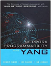
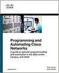
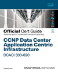
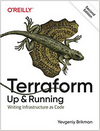
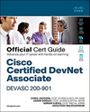
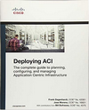
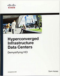
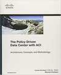
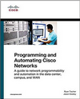
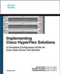

# **PRZECZYTANE KSIĄŻKI**

---

Okładka|Tytuł|Ocena
:-:|:-|:-:
||[Network Programmability with YANG](https://www.amazon.de/dp/0135180392)|5/5
||[Programming and Automating Cisco Networks](https://www.amazon.de/dp/1587144654/)|4/5
||[SSH Mastery](https://www.amazon.de/dp/1642350028)|4/5
||[CCNP Data Center Application Centric Infrastructure 300-620 DCACI Official Cert Guide](https://www.amazon.de/dp/B08JLZLNPY)|5/5
||[Terraform: Up and Running](https://www.amazon.de/dp/1492046906)|3/5
||[Cisco Certified Devnet Associate Devasc 200-901 Official Cert Guide](https://www.amazon.de/dp/0136642969)|5/5
||[Deploying ACI](https://www.amazon.de/dp/1587144743)|5/5
||[Hyperconverged Infrastructure Data Centers](https://www.amazon.de/dp/1587145103)|3/5
||[The Policy Driven Data Center with Aci](https://www.amazon.de/dp/1587144905)|3/5
||[Programming and Automating Cisco Networks](https://www.amazon.de/dp/1587144654)|4/5
||[Implementing Cisco Hyperflex Solutions](https://www.amazon.de/dp/013660191X)|3/5

---
